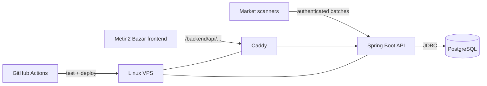

# Metin Market API

Production backend for **Metin2 Bazar** — ingesting marketplace scan data, storing immutable observations in PostgreSQL, and exposing server-specific search and statistics APIs.

**Live application:** [metin2bazar.pl](https://metin2bazar.pl) · **Frontend:** [mazikox/metin2-market-web](https://github.com/mazikox/metin2-market-web)

[](https://github.com/mazikox/metin2-market-api/actions/workflows/deploy.yml)


> Independent community project. Not affiliated with Gameforge.

## What it does

Market scanners publish batches of observed Metin2 shop listings to this API. The backend validates and deduplicates those observations, stores them in PostgreSQL, and serves them through read APIs used by the public web application.

The system currently handles separate catalogs for **Pandora**, **Elder**, and **Beavium**.

## Engineering highlights

### Idempotent ingestion

Scanner imports are designed to be safe to retry.

- each batch is identified by `sourceId + batchId`,
- replaying the same batch and payload returns `alreadyProcessed: true`,
- reusing a batch identity with different data returns HTTP 409,
- observations are additionally deduplicated by `sourceId + observationId`,
- changed fingerprints or conflicting observation payloads are rejected.

This keeps synchronization resilient to retries and partial network failures without silently duplicating market data.

### Multi-server data isolation

The API exposes server-specific routes and stores each server in its own PostgreSQL schema.

```text
pandora
elder
beavium
```

Flyway applies the same migration set independently to each schema at startup. The server is selected by the route, not by client-provided payload data.

### Historical market model

The API stores observations as historical records rather than trying to infer whether a shop is still active.

Each result can include:

- item identity and VNUM,
- price and quantity,
- indexed attributes and sockets,
- observation timestamp,
- shop VID, title and owner,
- map, channel and coordinates.

Search results are returned newest-first.

### Production deployment and routing

The backend is deployed to a Linux VPS and runs behind Caddy.

Production deployment includes:

1. automated tests,
2. remote application rebuild,
3. Caddy configuration validation,
4. Caddy config synchronization and reload,
5. API health checks across all supported servers,
6. routing smoke tests against the public site.

The same Caddy configuration also proxies the frontend's `/backend/api/... ` requests to this service.

### Integration testing

The test suite uses **Testcontainers** with PostgreSQL.

Integration tests verify real persistence behavior, Flyway migrations, scanner imports, deduplication, search results, and related child data against an actual PostgreSQL container instead of an in-memory database.

### Privacy-conscious catalog statistics

The project includes private usage statistics for the public catalog without third-party analytics scripts, advertising trackers, cookies, or persistent analytics identifiers.

Administrative statistics are exposed through protected routes and served behind Caddy authentication.

## Architecture



## Tech stack

| Area | Technology |
| --- | --- |
| Runtime | Java 26 |
| Framework | Spring Boot 4.1.1 |
| Web API | Spring MVC |
| Persistence | Spring JDBC |
| Database | PostgreSQL 18 |
| Migrations | Flyway |
| Validation | Jakarta Validation / Spring Validation |
| Testing | Spring Boot Test, Testcontainers |
| Infrastructure | Docker, Caddy, Linux VPS |
| CI/CD | GitHub Actions, SSH deployment |

## API overview

Server-specific public routes:

| Server | Search | Suggestions | Statistics |
| --- | --- | --- | --- |
| Pandora | `/api/v1/servers/pandora/items` | `/api/v1/servers/pandora/items/suggestions` | `/api/v1/servers/pandora/items/statistics` |
| Elder | `/api/v1/servers/elder/items` | `/api/v1/servers/elder/items/suggestions` | `/api/v1/servers/elder/items/statistics` |
| Beavium | `/api/v1/servers/beavium/items` | `/api/v1/servers/beavium/items/suggestions` | `/api/v1/servers/beavium/items/statistics` |

Scanner imports use matching protected routes:

```text
/internal/v1/servers/pandora/imports
/internal/v1/servers/elder/imports
/internal/v1/servers/beavium/imports
```

Legacy non-server-prefixed public routes remain aliases for Pandora for compatibility.

### Search example

```bash
curl "http://localhost:8080/api/v1/servers/pandora/items?query=Zatruty&page=0&size=20"
```

Search is case-insensitive and can also be narrowed by exact VNUM values.

## Project structure

```text
src/main/java/          application code
src/main/resources/     configuration and Flyway migrations
src/test/               automated and integration tests
ops/Caddyfile           production reverse-proxy configuration
docs/                   operational and migration documentation
tools/                  development/import utilities
samples/                sample scanner data
Dockerfile              API image
compose.yaml             local PostgreSQL + API environment
update_market.py         scanner synchronization utility
```

## Run locally

### Requirements

- Docker
- Java 26 if running the application outside Docker

### Docker Compose

Set the required secrets and start PostgreSQL together with the API.

PowerShell:

```powershell
$env:POSTGRES_PASSWORD = "replace-with-a-private-password"
$env:SCANNER_TOKEN = "pandora-private-token"
$env:SCANNER_TOKEN_ELDER = "elder-private-token"
$env:SCANNER_TOKEN_BEAVIUM = "beavium-private-token"
$env:ANALYTICS_SECRET = "replace-with-at-least-32-random-characters"
$env:ANALYTICS_PROXY_TOKEN = "replace-with-another-32-random-characters"

docker compose up --build
```

The API is available at:

```text
http://localhost:8080
```

PostgreSQL is exposed on localhost port `15432` by default.

### Run the application from the JDK

Start PostgreSQL first:

```powershell
docker compose up -d postgres
```

Then configure the database connection and run Spring Boot:

```powershell
$env:DATABASE_URL = "jdbc:postgresql://localhost:15432/metin_market"
$env:DATABASE_PASSWORD = $env:POSTGRES_PASSWORD

./mvnw.cmd spring-boot:run
```

## Import data

Example protected import:

```powershell
curl.exe -X POST http://localhost:8080/internal/v1/servers/pandora/imports `
  -H "Content-Type: application/json" `
  -H "X-Scanner-Token: $env:SCANNER_TOKEN" `
  --data-binary "@samples/import-example.json"
```

Each server requires its matching scanner token.

A development utility is also available for importing existing SQLite market history through the same HTTP API:

```bash
python tools/import_sqlite.py
```

For server-specific scanner synchronization:

```powershell
python update_market.py --server elder --database "C:\path\to\elder-history.db" --source-id "eldersuite-elder-main" --dry-run
```

## Tests

With Docker available:

```bash
./mvnw test
```

The suite starts PostgreSQL with Testcontainers, applies migrations, performs real-shaped imports, and verifies persisted search data.

## Source identity model

`sourceId` identifies a scanner installation/database and namespaces scanner-local identities so independent scanners cannot collide.

A scanner run is distinct from an HTTP synchronization batch. Shop VID is stored as part of an observation and is not treated as a permanent shop identity.

## Operations documentation

More detailed operational procedures live in `docs/`, including migration and private statistics documentation.

The main README intentionally focuses on the system architecture, public API, development setup, and production engineering model.

## Related repository

### [metin2-market-web](https://github.com/mazikox/metin2-market-web)

React / TypeScript frontend responsible for:

- server selection and marketplace UI,
- item search and price comparison,
- client-side resilience and saved searches,
- generated SEO metadata and static information pages,
- canonical routing and sitemap generation,
- frontend CI/CD and production HTTP smoke tests.
